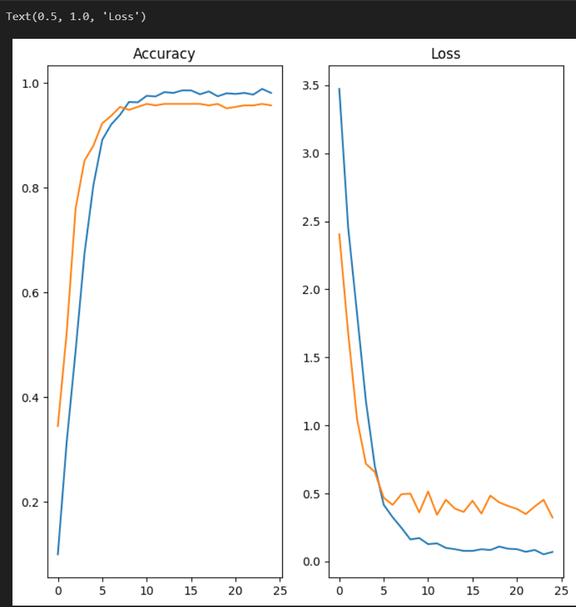

# Image Classification with TensorFlow

## Overview
This project implements a deep learning model using TensorFlow and Keras to classify images of fruits and vegetables into their respective categories. The model is trained on a custom dataset and achieves high accuracy through the use of convolutional neural networks (CNNs). The project is designed to be easy to use and adaptable for other image classification tasks.

---

## Features
- Custom dataset loading and preprocessing
- Convolutional Neural Network (CNN) for feature extraction and classification
- Real-time prediction on new images
- Model saving for future use
- Training and validation loss/accuracy visualization

---

## Dataset Structure
The dataset is organized into three folders:
- **train/**: Contains training images for each category.
- **test/**: Contains test images for evaluation.
- **validation/**: Contains validation images for hyperparameter tuning.

Ensure your dataset structure matches the following:
```
Fruits_Vegetables/
├── train/
│   ├── Category1/
│   ├── Category2/
│   └── ...
├── test/
│   ├── Category1/
│   ├── Category2/
│   └── ...
└── validation/
    ├── Category1/
    ├── Category2/
    └── ...
```

---

## Requirements
To run this project, you need the following Python libraries:

```
tensorflow
numpy
pandas
matplotlib
```

Install the dependencies using:
```bash
pip install -r requirements.txt
```

---

## Usage
1. Clone this repository:
   ```bash
   git clone https://github.com/your-username/Image_Classification_Project.git
   cd Image_Classification_Project
   ```

2. Prepare your dataset under the `Fruits_Vegetables/` directory.

3. Run the main script:
   ```bash
   python Image_Classification.py
   ```

4. To use the saved model for predictions, place a new image (e.g., `corn.jpg`) in the root directory and run the script. The model will predict the category and confidence level.

---

## Results
### Training and Validation Accuracy/Loss
The model’s performance is visualized during training using Matplotlib:
- **Training Accuracy vs. Validation Accuracy**
- **Training Loss vs. Validation Loss**

Example plot:



---

## Model
The trained model is saved as `Image_classify.keras` in the `saved_model/` directory. You can load it later using:
```python
from tensorflow.keras.models import load_model
model = load_model('saved_model/Image_classify.keras')
```

---

## Contributing
Contributions are welcome! Feel free to open an issue or submit a pull request if you find a bug or want to add a feature.

---

## Acknowledgments
- TensorFlow Documentation
- Keras API Guide
- Matplotlib for visualization

